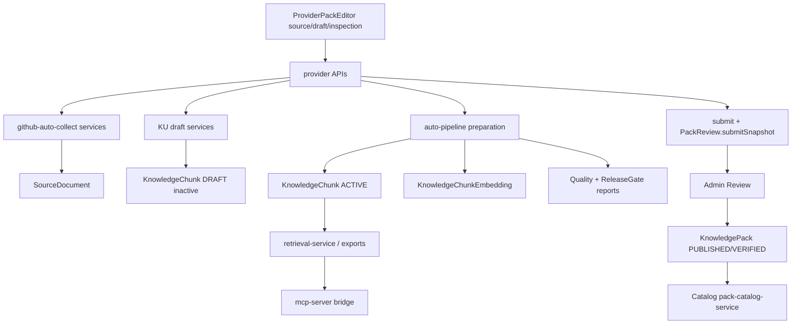

# 03. Builder Dependency Map

## 1. End-to-end 호출 흐름

## 2. 파일 단위 경로 표

| 단계 | 핵심 경로 |
|---|---|
| UI | `src/components/ProviderPackEditor.tsx`, `ProviderGitHubAutoCollectPanel.tsx`, `ProviderKnowledgeUnitDraftPanel.tsx`, `ProviderPackInspectionTab.tsx` |
| Provider API | `src/app/api/v1/provider/github/repository-discovery/route.ts`, `.../auto-collect/github/register/route.ts`, `.../knowledge-units/draft/route.ts`, `.../inspection/auto-prepare/route.ts`, `.../submit/route.ts` |
| Builder services | `src/lib/github-auto-collect/**`, `src/lib/knowledge-unit-draft/**`, `src/lib/auto-pipeline/**`, `src/lib/chunk-pipeline-service.ts` |
| Quality services | `src/lib/source-validation/**`, `structure-quality/**`, `chunk-quality/**`, `retrieval-evaluation/**`, `release-gate/**` |
| Prisma | `SourceDocument`, `KnowledgeChunk`, `KnowledgeChunkEmbedding`, quality/gate report models, `PipelineRun`, `PackReview` |
| Admin | `AdminReviewAdvancedActionsTab.tsx`, `AdminChunkManager`, `/admin/knowledge-unit-drafts` |
| Publish | `admin-review-service.ts` approve → `PackStatus.PUBLISHED/VERIFIED` |
| Catalog | `pack-catalog-service.ts` (상태/메타만) |
| Retrieval | `src/lib/retrieval/retrieval-service.ts`, `retrieval-response-mapper.ts` (`content: chunk.content`) |
| Export | `src/lib/exports/package-export-service.ts`, `rag-jsonl-export-service.ts` |
| MCP | `mcp-server/tool-handlers.ts` → Public APIs only |

## 3. Builder 삭제 시 직접 깨지는 화면

- Provider source 탭 GitHub 수집 UI
- Provider draft 탭 KU 생성/대기열 UX
- Provider inspection의 구조/청킹/검색 재평가 CTA
- Admin `/admin/knowledge-unit-drafts`
- Admin 고급 탭 Chunk Manager / 재점검 패널 일부

## 4. 간접적으로 깨지는 API / Runtime

| 소비자 | Builder 의존 | 영향 |
|---|---|---|
| Catalog | 없음(상태만) | UI 제거만으로 유지 가능 |
| Export package/rag-jsonl | `KnowledgeChunk.content` | **대체 전 삭제 금지** |
| Retrieval/Context | active chunks | **대체 전 삭제 금지** |
| MCP tools | Public retrieval/export | Chunk 데이터가 비면 결과 공백 |
| Admin approve gates | quality/release-gate | 게이트 정책을 유통검증으로 교체 필요 |
| AuditLog | `ADMIN_CHUNK_*`, pipeline actions | 이력 보존, 모델 즉시 삭제 금지 |

## 5. Published Pack 데이터 의존

기존 Published Pack은 다음을 사용한다.

1. `KnowledgePack` 메타 (Catalog)
2. Active `KnowledgeChunk` (+ optional embeddings) (Retrieval/Export)
3. Optional `SourceDocument` (출처 메타)
4. Optional Graph nodes/edges (graph export/query)

Quality report / PipelineRun은 런타임 검색에 필수가 아니다.

## 6. Audit / Usage

- `AuditAction`에 Builder 전용 액션 다수 (`ADMIN_CHUNK_*`, `PROVIDER_SOURCE_DOCUMENT_CREATE` 등)
- `ApiUsageLog`는 Retrieval/Export 호출 기록 — Chunk 모델 FK 없음, Pack/ApiKey만

## 7. 테스트·Seed 의존

- Builder 단위/통합: `src/__tests__/github-*.test.ts`, `*-knowledge-unit-draft*.test.ts`, `provider-review-auto-preparation-service.test.ts`, `ku-draft-ux-pipeline.test.ts`
- Seed: `prisma/seed.ts` structure templates + sample packs/chunks
- P28에서 UI/API 차단 시 해당 테스트도 함께 정리 또는 skip 정책 필요

## 8. 배포·Health

- Health/Ready는 DB/환경 검증 (`/api/health`, `/api/ready`) — Builder 파이프라인과 분리
- MCP 프로세스는 별도 (`npm run mcp:stdio|http`)
