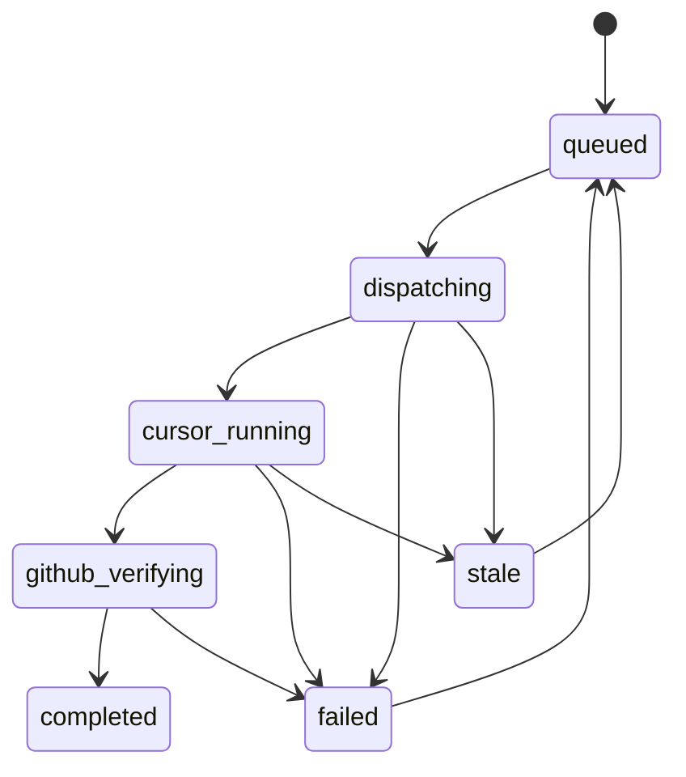
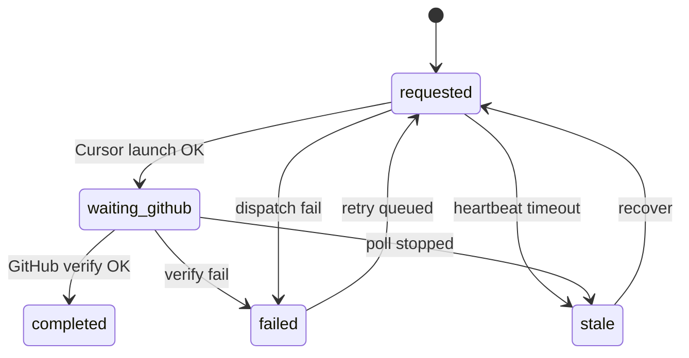

# P3 Refactor 설계서 — GitHub-Centric Runtime

## AS-IS

### 상태 머신



### 데이터 / SoT

```text
Task Cursor Job (pollCount, status)
        ↓ sync
ImplementationCodeTaskRun (runtimeState, taskCursorJobId, nextPollAt)
        ↓ UI
Bundle View / Diagnostics
```

**전이 트리거:** Cursor poll 결과 (`implementationRuntimeTaskCursorSync`).

**완료 트리거:** Task Cursor `github_verified` → DB `completed` + job advance.

### Poll 아키텍처

```text
claimDueImplementationRuntimePollRuns
  → taskCursorJobId 필수
  → runTaskCursorWorkerTick
       → pollTaskCursorExecutionOnce (Cursor API)
       → verifyTaskCursorGithubResult (GitHub REST, cursor_completed 후)
       → syncDbRuntimeAfterTaskCursorServerPoll
```

---

## TO-BE

### 목표 상태 (논리 모델)



### 데이터 / SoT

```text
GitHub (branch / commit / PR / merge)
        ↓ verifyImplementationRuntimeRunGithub
ImplementationCodeTaskRun.runtimeState (저장: 과도기 AS-IS enum, 표시: UserPhase)
        ↓ advance on verified commit
Next queued CodeTask
```

**Cursor (비-SoT):** `cursorAgentId`, `lastHeartbeatAt`, event log `cursor_*` — diagnostics only.

### GitHub Verify 서비스

`implementationGithubVerificationService.ts`

| 단계 | 동작 |
|------|------|
| Input | projectId, jobId, run, TaskCursorExecutionV1 (branch/sha/task), GitHub token |
| Verify | `verifyTaskCursorGithubResult` |
| Success | `completeImplementationRuntimeGithubVerifyAndAdvance` |
| Failure | `failImplementationRuntimeGithubVerify` |

향후 확장 (별 PR):

- `waiting_github` 진입 시 Cursor terminal 여부 무관 GitHub poll
- PR URL / merge 상태 필드 (`pullRequestUrl` 이미 partial)
- Webhook-driven verify (poll 축소)

### Poll TO-BE

```text
Phase 1 (현재+): Single tick, dual purpose
  - Cursor poll (dispatching/cursor_running) — 실행기 health
  - GitHub verify (github_verifying OR early waiting_github)

Phase 2: Split workers
  - implementationRuntimeCursorHealthTick (optional, low frequency)
  - implementationRuntimeGithubPollTick (SoT for completion)

Phase 3: Drop taskCursorJobId requirement for github-only runs
```

| 구성 | Phase 1 | Phase 2 | Phase 3 |
|------|---------|---------|---------|
| Run poll lock/schedule | 유지 | 유지 | 유지 |
| Job pollCount mirror | 축소 | Run only | Run only |
| claim `taskCursorJobId` | 유지 | GitHub tick은 run+branch | branch 기준 |
| Client JSON poll | Legacy | deprecate | remove |

---

## Migration Plan

### M0 — 문서 + 표시 레이어 (P3 3차 1단계, **비파괴**)

- [x] 진단/설계 문서
- [x] `implementationRuntimeGithubCentricModel` — UserPhase + KO labels
- [x] API diagnostics / overview / `formatRuntimeStateKo` → UserPhase 라벨
- [x] `implementationGithubVerificationService` façade + unit test (mapping)

**DB 변경 없음.** 기존 테스트 전부 green.

### M1 — Sync decouple (behind flag or run mode)

- `syncDbImplementationRuntimeAfterTaskCursorChange`:
  - Cursor status → **진단 필드만** (events/heartbeat)
  - `github_verifying` 진입: Cursor `cursor_completed` **또는** dispatch 후 grace elapsed
- GitHub verify 성공/실패만 `runtimeState` terminal 전환

**Feature flag:** `IMPLEMENTATION_RUNTIME_GITHUB_SOT=1` (env).

### M2 — Poll simplification

- `syncRunPollScheduleFromJob` 제거 → Run 단일 schedule
- `RUNTIME_POLL_SCHEDULE_STATES`: `requested` 매핑 상태 전부 → 하나의 poll bucket (`waiting_github` 포함)
- Watchdog: `orphan_cursor_running` → `stale` + GitHub recheck

### M3 — Schema (optional)

Prisma `RuntimeState` enum 축소 또는 `userPhase` computed column / view.

Migration script:

```sql
-- 예시 (실행 전 별도 리뷰)
-- UPDATE implementation_code_task_runs SET runtime_state = 'github_verifying'
--   WHERE runtime_state IN ('dispatching','cursor_running');
```

Map old values in API for 1 release.

### M4 — UI copy & legacy removal

- Board/Preview: "CodeTask 실행 중", "GitHub 결과 확인 중" (UserPhase)
- Legacy `implementationRuntimeStateV1` recovery 버튼 제거 조건: 모든 active project DB job

---

## 테스트 전략

| Layer | 테스트 |
|-------|--------|
| UserPhase map | `implementationRuntimeGithubCentricModel.unit.test.ts` |
| Sync (M1) | extend `implementationRuntimeTaskCursorSync.unit.test.ts` |
| Verify façade | mock `verifyTaskCursorGithubResult`, assert advance/fail |
| E2E | 기존 P2 manual runbook + GitHub verify fail path |

---

## 성공 기준

1. Runtime **complete**는 GitHub verify + advance 없이는 발생하지 않음 (현재도 준수, M1에서 Cursor-only complete 차단).
2. 사용자 UI에 Cursor 내부 상태명 미노출 (UserPhase KO).
3. Poll/lock 복잡도 감소 (M2 이후 Run 단일 schedule).
4. `projects/JYOrchestration` 외 변경 없음.

---

*진단: [p3-github-centric-runtime-diagnosis.md](./p3-github-centric-runtime-diagnosis.md)*
